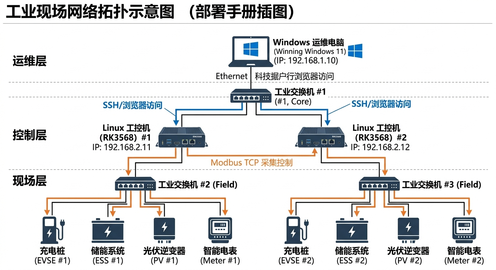
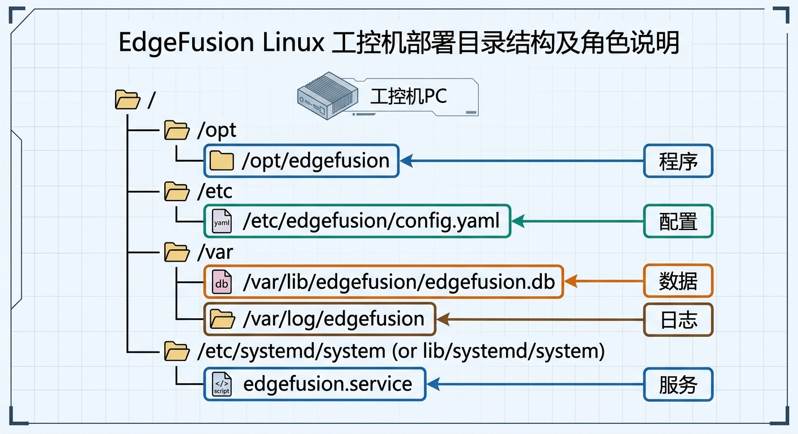
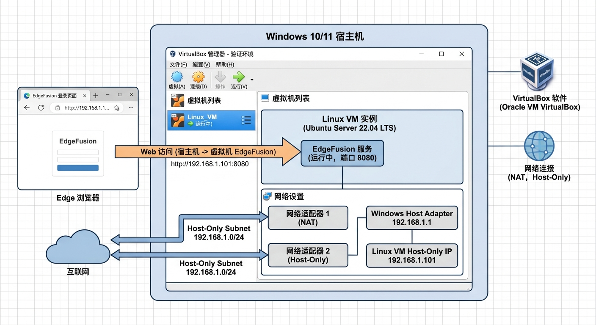

# EdgeFusion Linux 工控机部署、更新与维护手册

这份手册面向第一次接触 EdgeFusion 的同事，重点讲清楚三件事：

1. 在哪台机器上操作
2. 在 Linux 工控机上如何首次部署
3. 后续如何更新、备份、恢复和排障

主线以 `RK3568` 核心板上的 Linux 工控机为例，最后补充一节“手头没有设备时，如何用 VirtualBox 快速验证”。

> 适用前提：目标机器运行的是带 `systemd` 的 Linux（常见 Debian/Ubuntu ARM64 镜像都可以）。如果是极简 BusyBox 系统、没有 `systemd`，就不能直接照搬本文。

## 0. 先分清楚 4 个对象

很多新手第一次部署会混淆“命令到底在哪台机器上执行”。先把角色分清：

| 对象 | 作用 | 你通常在这里做什么 |
|------|------|--------------------|
| Windows 运维电脑 | 你的办公电脑 | 打开浏览器、SSH 到工控机、上传源码、看 Web 页面 |
| Linux 工控机（RK3568） | EdgeFusion 正式运行的机器 | 执行 `deploy.sh`、修改正式配置、查看服务状态 |
| 现场设备 | 光伏、储能、充电桩、电表等 | 一般不在这里跑命令，只需要确认 IP/串口参数 |
| VirtualBox 虚拟机 | 没设备时的验证环境 | 验证部署、升级、备份、恢复流程是否跑通 |

请记住下面这条原则：

> `deploy.sh`、`backup.sh`、`restore.sh`、`uninstall.sh` 这些命令，都是在 Linux 工控机或 Linux 虚拟机里执行，不是在 Windows 上执行。

## 1. 正式部署前，先想清楚网络

EdgeFusion 自身会在工控机上启动 Web 面板，默认监听：

- Web 面板：`0.0.0.0:5000`
- Modbus TCP 常见设备端口：`502`
- MQTT 默认端口：`1883`
- OCPP 默认端口：`8080`

其中最常用的是 `5000`（浏览器访问）和 `502`（Modbus TCP 设备接入）。

### 1.1 推荐的现场网络思路

最容易理解的做法是把网络分成两类：

1. 设备网
   Linux 工控机和现场设备在同一个网段，例如 `192.168.10.0/24`
2. 运维网
   Windows 运维电脑能访问到工控机的管理 IP，例如 `192.168.20.0/24`

如果工控机只有一个网口，也可以先把运维电脑和设备都放在同一个调试网段里，只要 IP 不冲突即可。

一个简单示例：

- Linux 工控机：`192.168.10.20`
- 充电桩：`192.168.10.101`
- 储能：`192.168.10.102`
- 光伏：`192.168.10.103`
- Windows 运维电脑：`192.168.10.50`

> 如果现场网络不出互联网，只做局域网联调，那么“网关”可以先不填；只要同网段互通即可。

[插图占位 1：现场网络拓扑]

Prompt: `工业现场网络拓扑示意图，中文标注，风格清晰专业。画面包含 Windows 运维电脑、Linux 工控机（RK3568）、交换机、充电桩、储能、光伏、电表。用箭头标出“SSH/浏览器访问”和“Modbus TCP 采集控制”两类流量。白底、工程文档风格、适合作为部署手册插图。`




### 1.2 第一次上电后，先在 Linux 工控机上确认网卡名

下面命令在 Linux 工控机上执行：

```bash
ip -br addr
ip route
```

常见网卡名可能是：

- `eth0`
- `end0`
- `enP1p0s0`

后面示例统一用 `eth0`，如果你的实际名字不同，请替换成自己的网卡名。

### 1.3 临时配置静态 IP（适合现场先试通）

下面命令在 Linux 工控机上执行：

```bash
sudo ip link set eth0 up
sudo ip addr flush dev eth0
sudo ip addr add 192.168.10.20/24 dev eth0
```

验证：

```bash
ip -br addr show eth0
ping -c 4 192.168.10.101
```

如果 `ping` 不通，先不要急着部署程序，先确认：

- 网线和交换机正常
- 设备确实上电
- 设备 IP 和工控机 IP 在同一网段
- 设备没有和别的机器 IP 冲突

### 1.4 持久化配置静态 IP

不同 Linux 发行版的持久化方式不同，现场最常见有两类。

#### 方案 A：系统带 NetworkManager，用 `nmcli`

下面命令在 Linux 工控机上执行：

```bash
nmcli connection show
sudo nmcli connection modify "Wired connection 1" \
  ipv4.method manual \
  ipv4.addresses 192.168.10.20/24 \
  ipv4.gateway "" \
  ipv4.dns "223.5.5.5 114.114.114.114"
sudo nmcli connection up "Wired connection 1"
```

#### 方案 B：系统用 netplan

下面命令在 Linux 工控机上执行：

```bash
sudoedit /etc/netplan/01-edgefusion.yaml
```

参考内容：

```yaml
network:
  version: 2
  ethernets:
    eth0:
      dhcp4: false
      addresses:
        - 192.168.10.20/24
```

应用配置：

```bash
sudo netplan apply
```

### 1.5 从 Windows 运维电脑验证是否能访问工控机

下面命令在 Windows 运维电脑上执行：

```powershell
ping 192.168.10.20
ssh <你的Linux用户名>@192.168.10.20
```

如果还没开 SSH，可以先在工控机本地插显示器和键盘完成第一轮网络设置，后续再切回远程运维。

## 2. 先记住正式运行的几个目录

首次部署完成后，EdgeFusion 的正式运行目录不是源码目录，而是下面这些标准路径：

- 程序目录：`/opt/edgefusion`
- 配置目录：`/etc/edgefusion`
- 正式配置文件：`/etc/edgefusion/config.yaml`
- 数据目录：`/var/lib/edgefusion`
- SQLite 数据库：`/var/lib/edgefusion/edgefusion.db`
- 日志目录：`/var/log/edgefusion`
- systemd 服务文件：`/etc/systemd/system/edgefusion.service`

这点非常重要：

> 正式服务读的是 `/etc/edgefusion/config.yaml`，不是仓库根目录里的 `config.yaml`。  
> 部署完成后，如果你要改正式配置，请改 `/etc/edgefusion/config.yaml`。

## 3. RK3568 工控机首次部署

### 3.1 准备源码

推荐在 Linux 工控机上保留一个“源码工作目录”，例如：

```bash
mkdir -p ~/src
cd ~/src
```

获取源码有两种常见方式。

#### 方式 A：工控机能联网，直接 `git clone`

下面命令在 Linux 工控机上执行：

```bash
cd ~/src
git clone <你的仓库地址> edgefusion
cd edgefusion
```

#### 方式 B：工控机不能联网，用 Windows 电脑上传

下面命令在 Windows 运维电脑上执行：

```powershell
scp -r .\edgefusion <你的Linux用户名>@192.168.10.20:~/src/
```

然后在 Linux 工控机上进入源码目录：

```bash
cd ~/src/edgefusion
```

### 3.2 检查 Python

`deploy.sh` 需要 Python `3.10`、`3.11` 或 `3.12`，并且要有 `venv` 和 `pip`。

下面命令在 Linux 工控机上执行：

```bash
python3 --version
python3 -m venv --help
```

如果系统没有合适的 Python，可以直接使用仓库里的安装脚本。这个脚本会自动识别 `aarch64/arm64`，适合 `RK3568` 这类 ARM64 板卡。

下面命令在 Linux 工控机上执行：

```bash
cd ~/src/edgefusion
chmod +x install_python.sh
sudo ./install_python.sh --version 3.11
```

### 3.3 首次部署

下面命令在 Linux 工控机上执行：

```bash
cd ~/src/edgefusion
chmod +x deploy.sh run_local.sh backup.sh restore.sh uninstall.sh install_python.sh
sudo ./deploy.sh
```

脚本会做这些事情：

1. 询问服务名、运行用户、程序目录、配置目录、数据目录、日志目录
2. 在首次部署时自动创建系统用户（默认是 `edgefusion`）
3. 把当前源码同步到 `/opt/edgefusion`
4. 创建或复用 `/opt/edgefusion/.venv`
5. 安装 `requirements-prod.txt`
6. 初始化 `/etc/edgefusion/config.yaml`
7. 生成并安装 `systemd` 服务
8. 启动 `edgefusion` 服务

如果你直接回车，默认值就是：

- 服务名：`edgefusion`
- 运行用户：`edgefusion`
- 程序目录：`/opt/edgefusion`
- 配置目录：`/etc/edgefusion`
- 数据目录：`/var/lib/edgefusion`
- 日志目录：`/var/log/edgefusion`

### 3.4 首次部署后立即检查服务

下面命令在 Linux 工控机上执行：

```bash
sudo systemctl status edgefusion --no-pager -l
sudo journalctl -u edgefusion -n 50 --no-pager
```

如果服务正常，再在 Windows 运维电脑上打开浏览器访问：

```text
http://192.168.10.20:5000
```

> 当前 Web 面板默认监听 `0.0.0.0:5000`，适合同网段调试，但默认没有 HTTPS 和登录鉴权。请只放在内网、调试网或 VPN 后面，不要直接暴露到公网。

[插图占位 2：目录与部署结果]

Prompt: `一张中文运维手册插图，展示 Linux 工控机上 EdgeFusion 部署后的目录结构。重点突出 /opt/edgefusion、/etc/edgefusion/config.yaml、/var/lib/edgefusion/edgefusion.db、/var/log/edgefusion 和 edgefusion.service。用箭头说明“程序”“配置”“数据”“日志”“服务”五个角色。简洁工程图风格。`、


## 4. 首次投运前，先把配置改成“安全模式”

仓库自带的 `config.yaml` 更偏开发/仿真默认值。真机第一次上站，建议先改成更安全的状态。

下面命令在 Linux 工控机上执行：

```bash
sudoedit /etc/edgefusion/config.yaml
```

建议先确认下面几项：

```yaml
control:
  use_simulated_devices: false
  read_only: true

simulation:
  enabled: false

monitor:
  dashboard_host: 0.0.0.0
  dashboard_port: 5000
```

含义如下：

- `use_simulated_devices: false`
  不让策略优先作用在模拟设备上
- `read_only: true`
  先以只读观察模式投运，避免误写现场设备
- `simulation.enabled: false`
  关闭内置仿真，避免把模拟数据当成现场数据
- `dashboard_host: 0.0.0.0`
  允许同网段运维电脑访问 Web 页面

改完后重启服务：

```bash
sudo systemctl restart edgefusion
sudo systemctl status edgefusion --no-pager -l
```

> 建议第一次真机联调先保持 `read_only: true`。等你确认设备地址、点表、读值方向都没问题后，再切成 `false` 放开写控制。

## 5. 真机联调时，先确认“设备网络通了”，再看页面

很多问题不是程序没部署好，而是工控机根本连不到设备。

### 5.1 先从工控机直接探测设备

下面命令在 Linux 工控机上执行：

```bash
cd /opt/edgefusion
./.venv/bin/python ./modbus_probe.py \
  --host 192.168.10.101 \
  --port 502 \
  --unit-id 1 \
  --device-type charging_station \
  --vendor xj \
  --model xj_dc_120kw
```

如果这个命令都不通，就先不要怀疑 Web 页面，先回头检查：

- 工控机和设备 IP 是否互通
- 设备端口是不是 `502`
- `unit_id` 是否正确
- 型号、厂商是否选对

### 5.2 再去 Web 页面做正式接入

浏览器建议在 Windows 运维电脑上打开：

```text
http://192.168.10.20:5000
```

典型流程是：

1. 测试连接
2. 加入候选设备
3. 在候选设备列表里执行“接入”
4. 观察设备状态和数据采集情况

如果你看到的还是模拟数据，通常是这两个值没改对：

- `/etc/edgefusion/config.yaml` 里的 `simulation.enabled`
- `/etc/edgefusion/config.yaml` 里的 `control.use_simulated_devices`

## 6. 后续更新应用怎么做

更新的核心原则只有一句话：

> 更新程序文件时，运行 `deploy.sh`；  
> 修改正式配置时，改 `/etc/edgefusion/config.yaml`；  
> 更新前先备份数据库和配置。

### 6.1 标准更新流程

下面命令在 Linux 工控机上执行：

```bash
cd /opt/edgefusion
sudo ./backup.sh
```

然后进入新的源码目录更新：

```bash
cd ~/src/edgefusion
git pull
sudo ./deploy.sh
```

更新完成后检查：

```bash
sudo systemctl status edgefusion --no-pager -l
sudo journalctl -u edgefusion -n 100 --no-pager
```

### 6.2 什么时候用 `--reinstall`

如果你怀疑是虚拟环境或依赖包损坏，用：

```bash
cd ~/src/edgefusion
sudo ./deploy.sh --reinstall
```

它会重建 `/opt/edgefusion/.venv` 并重新安装依赖。

### 6.3 什么时候用 `--rollback`

如果升级后程序文件有问题，可以尝试：

```bash
cd ~/src/edgefusion
sudo ./deploy.sh --rollback
```

但一定要知道它的边界：

- `--rollback` 回滚的是程序目录 `/opt/edgefusion`
- 它不会自动回滚 `/etc/edgefusion/config.yaml`
- 它不会自动回滚 `/var/lib/edgefusion/edgefusion.db`

所以在重要升级前，`backup.sh` 仍然是必须的。

## 7. 日常维护怎么做

### 7.1 看服务状态

下面命令在 Linux 工控机上执行：

```bash
sudo systemctl status edgefusion --no-pager -l
```

### 7.2 看日志

下面命令在 Linux 工控机上执行：

```bash
sudo journalctl -u edgefusion -f
ls -lh /var/log/edgefusion
```

除了 `journalctl`，应用还会在 `/var/log/edgefusion` 下写文件日志，文件名类似：

- `edgefusion_20260402.log`

### 7.3 改配置后重启

下面命令在 Linux 工控机上执行：

```bash
sudoedit /etc/edgefusion/config.yaml
sudo systemctl restart edgefusion
sudo systemctl status edgefusion --no-pager -l
```

### 7.4 备份

下面命令在 Linux 工控机上执行：

```bash
cd /opt/edgefusion
sudo ./backup.sh
```

默认备份目录类似：

- `/var/backups/edgefusion/20260402-153000/`

里面至少有两个关键文件：

- `config.yaml`
- `edgefusion.db`

### 7.5 恢复

下面命令在 Linux 工控机上执行：

```bash
cd /opt/edgefusion
sudo ./restore.sh /var/backups/edgefusion/20260402-153000
```

恢复脚本会自动停服务、恢复配置和数据库，然后再尝试把服务拉起来。

### 7.6 卸载

保留配置和数据，只移除程序和服务：

```bash
cd /opt/edgefusion
sudo ./uninstall.sh
```

彻底清理：

```bash
cd /opt/edgefusion
sudo ./uninstall.sh --purge
```

## 8. 一张“谁来操作什么”的速查表

| 场景 | Windows 运维电脑 | Linux 工控机 |
|------|------------------|--------------|
| 第一次联网 | `ping`、`ssh` | 配静态 IP、确认网卡 |
| 首次部署 | 上传源码、开浏览器 | 执行 `sudo ./deploy.sh` |
| 修改配置 | 通常只负责远程连接 | 改 `/etc/edgefusion/config.yaml` |
| 看页面 | 打开 `http://<工控机IP>:5000` | 提供服务本身 |
| 备份恢复 | 记录备份目录 | 执行 `backup.sh` / `restore.sh` |
| 版本更新 | 可推代码或上传源码包 | `git pull` 后重新 `deploy.sh` |
| 回滚排障 | 查看现象 | `journalctl`、`--rollback`、恢复备份 |

## 9. 常见问题

### 9.1 浏览器打不开页面

先按这个顺序查：

1. Windows 电脑能不能 `ping` 通工控机
2. Linux 工控机上 `systemctl status edgefusion` 是否正常
3. `journalctl -u edgefusion -n 100 --no-pager` 是否报错
4. `/etc/edgefusion/config.yaml` 里的 `dashboard_port` 是否还是 `5000`
5. 工控机防火墙是否拦截了 `5000/tcp`

### 9.2 服务启动失败，日志提示 Python 不满足要求

在 Linux 工控机上安装正确版本的 Python：

```bash
cd ~/src/edgefusion
sudo ./install_python.sh --version 3.11
sudo ./deploy.sh --reinstall
```

### 9.3 明明连了真设备，页面里却还是模拟数据

重点检查：

- `/etc/edgefusion/config.yaml` 的 `simulation.enabled` 是否为 `false`
- `/etc/edgefusion/config.yaml` 的 `control.use_simulated_devices` 是否为 `false`

### 9.4 改了仓库里的 `config.yaml`，为什么正式服务没变化

因为正式服务读的是：

- `/etc/edgefusion/config.yaml`

不是源码目录里的：

- `~/src/edgefusion/config.yaml`
- `/opt/edgefusion/config.yaml`

### 9.5 升级后想回退，`--rollback` 够不够

如果只是程序文件出了问题，可能够。  
如果你连配置或数据库都变了，只靠 `--rollback` 不够，应该优先使用 `backup.sh` + `restore.sh`。

## 10. 没有 RK3568 实物时，怎么用 VirtualBox 快速验证

VirtualBox 这部分的目标不是模拟 ARM 硬件，而是快速验证下面这些流程：

- 部署是否能跑通
- `systemd` 服务是否能拉起
- 升级、回滚、备份、恢复是否符合预期
- Web 页面是否能从宿主机访问

> VirtualBox 通常是 `x86_64` 虚拟机，不是 `RK3568/ARM64`。它适合验证部署流程，不适合验证板卡驱动、串口外设、真实现场性能。

### 10.1 推荐的虚拟机配置

在 Windows 运维电脑上操作：

1. 安装 VirtualBox
2. 创建一台 Ubuntu 22.04 或 Debian 12 虚拟机
3. 资源建议：
   - CPU：2 核
   - 内存：4 GB
   - 磁盘：20 GB 起
4. 网卡建议：
   - 网卡 1：NAT（让虚拟机能联网装包/拉代码）
   - 网卡 2：Host-Only（让宿主机浏览器能直接访问虚拟机）

[插图占位 3：VirtualBox 验证拓扑]

Prompt: `中文技术插图，展示 Windows 主机上的 VirtualBox 验证环境。画面包含 Windows 宿主机、VirtualBox 中的 Linux 虚拟机、NAT 网络、Host-Only 网络，以及宿主机浏览器访问虚拟机 EdgeFusion Web 页面的箭头。配色克制、适合软件部署文档。`

### 10.2 在虚拟机里执行部署

下面命令在 Linux 虚拟机里执行：

```bash
sudo apt update
sudo apt install -y git
mkdir -p ~/src
cd ~/src
git clone <你的仓库地址> edgefusion
cd edgefusion
chmod +x deploy.sh run_local.sh backup.sh restore.sh uninstall.sh install_python.sh
sudo ./deploy.sh
```

### 10.3 最快的验证方式

如果你只是想先看到页面跑起来，可以保留默认仿真配置，然后在 Windows 宿主机浏览器打开：

```text
http://<虚拟机IP>:5000
```

如果你不知道虚拟机 IP，在 Linux 虚拟机里执行：

```bash
ip -br addr
```

### 10.4 想顺手验证“设备接入流程”，可以再开一个模拟器

下面命令在 Linux 虚拟机里另开一个终端执行：

```bash
cd /opt/edgefusion
./.venv/bin/python ./modbus_charger_simulator.py --model xj_dc_120kw --port 5020
```

这里故意使用 `5020` 而不是 `502`，是为了避免普通用户在 Linux 上绑定低端口时遇到权限问题。

然后再访问 Web 页面，用下面参数去测：

- host：虚拟机自己的 IP，或 `127.0.0.1`
- port：`5020`
- unit_id：`1`
- model：`xj_dc_120kw`

### 10.5 建议加一个虚拟机快照

在你准备测试升级、回滚、恢复之前，先在 VirtualBox 里打一个快照。这样你可以反复练习：

1. 首次部署
2. 更新版本
3. 运行 `backup.sh`
4. 人为改坏配置
5. 运行 `restore.sh`
6. 验证服务恢复

## 11. 一套推荐的实际工作顺序

如果你是第一次把 EdgeFusion 上到 Linux 工控机，建议严格按这个顺序做：

1. 在 Linux 工控机上先把网络配通
2. 从 Windows 运维电脑确认 `ping` 和 `ssh` 可达
3. 在 Linux 工控机上准备源码
4. 安装 Python（如果系统缺）
5. 执行 `sudo ./deploy.sh`
6. 修改 `/etc/edgefusion/config.yaml`，先关仿真、开只读
7. 重启服务并确认 Web 页面可访问
8. 用 `modbus_probe.py` 从工控机探测第一台真实设备
9. 在 Web 页面完成设备接入
10. 接入稳定后，再把 `read_only` 改回 `false`

做到这一步，部署、更新和维护的主流程就已经打通了。
